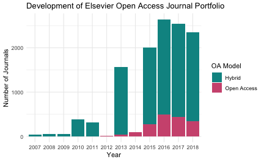

# Does Elsevier's flip the open access business model of its journals?

### Prepare data


```r
library(tidyverse)
```

load lisas files


```r
my_df <- readr::read_delim("data/elsevier_07_18.csv",col_names = FALSE, delim = ";") %>%
  select(issn = X1, journal_name = X2, oa_model = X3, apc = X4, file = X5) %>%
  mutate(year = str_extract(file, "\\d{4}$"))
```


backup cleaned version


```r
writexl::write_xlsx(my_df, "data/elsevier_07_18_cleaned.xlsx")
```

retrieve flipped journals, i.e. journals with more than one oa model over time


```r
my_df %>%
  distinct(issn, oa_model) %>%
  filter(!is.na(oa_model)) %>%
  group_by(issn) %>%
  filter(n() > 1) -> flipped_jns
```

create a data dump of all flipped journals


```r
my_df %>%
  filter(issn %in% flipped_jns$issn) %>%
  arrange(journal_name, year) %>%
  group_by(issn) %>%
  slice(which.max(year)) %>%
  readr::write_csv("data/elsevier_07_18_flipped.csv")
```

##  Results

### OA / reverse flips

Current Elsevier journals


```r
my_df %>%
  filter(issn %in% flipped_jns$issn) %>%
  arrange(journal_name, year) %>%
  group_by(issn) %>%
  slice(which.max(year)) %>%
  filter(year == 2018) %>%
  ungroup() %>%
  count(oa_model) %>%
  knitr::kable()
```


|oa_model    |  n|
|:-----------|--:|
|Hybrid      | 13|
|Open Access | 26|

### Show reverse flips


```r
my_df %>%
  filter(issn %in% flipped_jns$issn) %>%
  arrange(journal_name, year) %>%
  group_by(issn) %>%
  slice(which.max(year)) %>%
  filter(year == 2018) %>%
  filter(oa_model == "Hybrid") -> rev_flipped
```

includde year of flip


```r
my_df %>%
  filter(issn %in% rev_flipped$issn) %>%
  filter(oa_model == "Open Access") %>%
  group_by(issn) %>% 
  slice(which.max(year)) %>%
  mutate(year_flipped = as.integer(year) + 1) %>%
  select(issn, year_flipped) %>%
  right_join(rev_flipped, by = "issn") %>%
  arrange(desc(year_flipped), journal_name) -> rev_flipped
write_csv(rev_flipped, "data/elsevier_07_18_rev_flipped.csv")
rev_flipped %>%
  knitr::kable()
```


|issn      | year_flipped|journal_name                                            |oa_model |apc  |file                        |year |
|:---------|------------:|:-------------------------------------------------------|:--------|:----|:---------------------------|:----|
|1876-6102 |         2018|Energy Procedia                                         |Hybrid   |0    |Elsevier OA Price List 2018 |2018 |
|2214-9996 |         2017|Annals of Global Health                                 |Hybrid   |1200 |Elsevier OA Price List 2018 |2018 |
|2352-2143 |         2017|Computational Condensed Matter                          |Hybrid   |1000 |Elsevier OA Price List 2018 |2018 |
|1878-450X |         2017|International Journal of Gastronomy and Food Science    |Hybrid   |3000 |Elsevier OA Price List 2018 |2018 |
|1369-7021 |         2017|Materials Today                                         |Hybrid   |3300 |Elsevier OA Price List 2018 |2018 |
|2215-0382 |         2016|Colloid and Interface Science Communications            |Hybrid   |1500 |Elsevier OA Price List 2018 |2018 |
|2215-1532 |         2016|Environmental Nanotechnology, Monitoring and Management |Hybrid   |1950 |Elsevier OA Price List 2018 |2018 |
|2213-5383 |         2016|Journal of Cancer Policy                                |Hybrid   |1600 |Elsevier OA Price List 2018 |2018 |
|2214-5400 |         2016|Meta Gene                                               |Hybrid   |1500 |Elsevier OA Price List 2018 |2018 |
|2212-6864 |         2016|Physics of the Dark Universe                            |Hybrid   |2000 |Elsevier OA Price List 2018 |2018 |
|2352-4073 |         2016|Plant Gene                                              |Hybrid   |1500 |Elsevier OA Price List 2018 |2018 |
|2214-9937 |         2016|Sustainable Materials and Technologies                  |Hybrid   |1100 |Elsevier OA Price List 2018 |2018 |
|2214-1677 |         2015|JCRS Online Case Reports                                |Hybrid   |3000 |Elsevier OA Price List 2018 |2018 |

### Show OA flips


```r
my_df %>%
  filter(issn %in% flipped_jns$issn) %>%
  arrange(journal_name, year) %>%
  group_by(issn) %>%
  slice(which.max(year)) %>%
  filter(year == 2018) %>%
  filter(oa_model == "Open Access") %>%
  knitr::kable()
```


|issn      |journal_name                                                      |oa_model    |apc  |file                        |year |
|:---------|:-----------------------------------------------------------------|:-----------|:----|:---------------------------|:----|
|0213-4853 |Neurología                                                        |Open Access |0    |Elsevier OA Price List 2018 |2018 |
|0370-2693 |Physics Letters B                                                 |Open Access |0    |Elsevier OA Price List 2018 |2018 |
|0550-3213 |Nuclear Physics, Section B                                        |Open Access |0    |Elsevier OA Price List 2018 |2018 |
|1201-9712 |International Journal of Infectious Diseases                      |Open Access |1750 |Elsevier OA Price List 2018 |2018 |
|1571-0661 |Electronic Notes in Theoretical Computer Science                  |Open Access |0    |Elsevier OA Price List 2018 |2018 |
|1672-0229 |Genomics, Proteomics and Bioinformatics                           |Open Access |0    |Elsevier OA Price List 2018 |2018 |
|1755-4365 |Epidemics                                                         |Open Access |1850 |Elsevier OA Price List 2018 |2018 |
|1836-9553 |Journal of Physiotherapy                                          |Open Access |0    |Elsevier OA Price List 2018 |2018 |
|1873-5061 |Stem Cell Research                                                |Open Access |2000 |Elsevier OA Price List 2018 |2018 |
|1876-3804 |Petroleum Exploration and Development Online                      |Open Access |3000 |Elsevier OA Price List 2018 |2018 |
|1877-0428 |Procedia - Social and Behavioral Sciences                         |Open Access |0    |Elsevier OA Price List 2018 |2018 |
|1878-9293 |Developmental Cognitive Neuroscience                              |Open Access |1750 |Elsevier OA Price List 2018 |2018 |
|2095-2686 |International Journal of Mining Science and Technology            |Open Access |0    |Elsevier OA Price List 2018 |2018 |
|2173-5808 |Neurología (English Edition)                                      |Open Access |0    |Elsevier OA Price List 2018 |2018 |
|2210-2612 |International Journal of Surgery Case Reports                     |Open Access |700  |Elsevier OA Price List 2018 |2018 |
|2210-6006 |Journal of Epidemiology and Global Health                         |Open Access |0    |Elsevier OA Price List 2018 |2018 |
|2211-3207 |International Journal for Parasitology: Drugs and Drug Resistance |Open Access |1838 |Elsevier OA Price List 2018 |2018 |
|2211-3797 |Results in Physics                                                |Open Access |850  |Elsevier OA Price List 2018 |2018 |
|2211-7539 |Medical Mycology Case Reports                                     |Open Access |450  |Elsevier OA Price List 2018 |2018 |
|2212-1374 |Journal of Bone Oncology                                          |Open Access |2000 |Elsevier OA Price List 2018 |2018 |
|2212-6287 |Arthroscopy Techniques                                            |Open Access |900  |Elsevier OA Price List 2018 |2018 |
|2213-0071 |Respiratory Medicine Case Reports                                 |Open Access |450  |Elsevier OA Price List 2018 |2018 |
|2213-0489 |Leukemia Research Reports                                         |Open Access |600  |Elsevier OA Price List 2018 |2018 |
|2213-2244 |International Journal for Parasitology: Parasites and Wildlife    |Open Access |1800 |Elsevier OA Price List 2018 |2018 |
|2214-8515 |Journal of African Trade                                          |Open Access |0    |Elsevier OA Price List 2018 |2018 |
|2352-6440 |Trauma Case Reports                                               |Open Access |750  |Elsevier OA Price List 2018 |2018 |

## Development of Elsevier Open Access Journal Portfolio by year


```r
my_df %>% 
  group_by(year) %>%
  count(oa_model) %>%
  ggplot(aes(year, n, fill = oa_model)) +
  geom_bar(stat = "identity") +
  labs(title = "Development of Elsevier Open Access Journal Portfolio") +
  ylab("Number of Journals") +
  xlab("Year") +
  scale_fill_manual("OA Model", values = c("#009392", "#d0587e")) +
  theme_minimal()
```



```r
  ggsave("elsevier_07_18.pdf", width = 6, height = 6 * 0.618, dpi = "retina")
```

Discontinued journals by open access business models


```r
  my_df %>%
    arrange(journal_name, year) %>%
    group_by(issn) %>%
    slice(which.max(year)) %>%
    filter(year < 2018) %>%
    ungroup() %>%
    count(oa_model, year) %>%
    ggplot(aes(year, n, fill = oa_model)) +
    geom_bar(stat = "identity") +
    labs(title = "Discontinued titles in Elsevier's Open Access Journal Portfolio") +
    ylab("Number of Journals") +
    xlab("Year") +
    scale_fill_manual("OA Model", values = c("#009392", "#d0587e")) +
    theme_minimal()
```


```r
  ggsave("elsevier_07_18_discontinued.pdf", width = 6, height = 6 * 0.618, dpi = "retina")
```

backup data of discontinued Elsevier data


```r
  my_df %>%
    arrange(journal_name, year) %>%
    group_by(issn) %>%
    slice(which.max(year)) %>%
    filter(year < 2018) %>%
    slice(which.max(year)) %>%
    write_csv("elsevier_discontinued_jns.csv")
```

