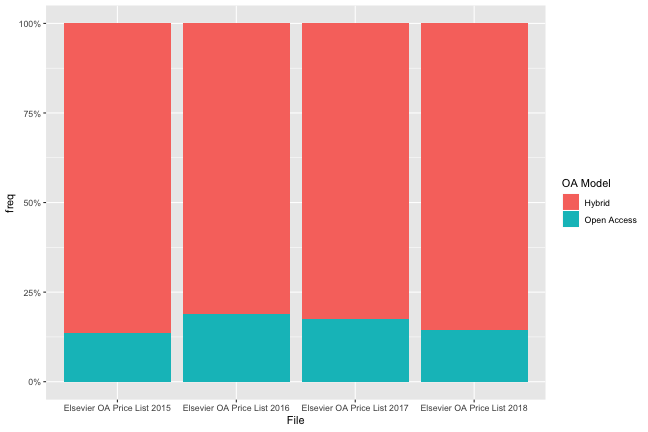

load lisa's file


```r
my_df <- readxl::read_xlsx("data/elsevier_13-18.xlsx", col_types = "text")
```

number of files


```r
my_df %>%
  distinct(File)
#> # A tibble: 5 x 1
#>   File                       
#>   <chr>                      
#> 1 Elsevier OA List 2013      
#> 2 Elsevier OA Price List 2015
#> 3 Elsevier OA Price List 2016
#> 4 Elsevier OA Price List 2017
#> 5 Elsevier OA Price List 2018
```

number of distinct journals


```r
my_df %>%
  distinct(ISSN, `OA Model`) %>%
  filter(!is.na(`OA Model`)) %>%
  group_by(ISSN) %>%
  filter(n() > 1) -> flipped_jns
```

show flipped journals


```r
my_df %>%
  filter(ISSN %in% flipped_jns$ISSN) %>% 
  select(1:5) %>%
  arrange(ISSN, File) %>%
  knitr::kable()
```


|ISSN      |Journal Title                                                                     |OA Model    |APC  |File                        |
|:---------|:---------------------------------------------------------------------------------|:-----------|:----|:---------------------------|
|0213-4853 |Neurología                                                                        |Hybrid      |3000 |Elsevier OA Price List 2016 |
|0213-4853 |Neurología† fee not payable by author                                             |Open Access |0    |Elsevier OA Price List 2017 |
|0213-4853 |Neurología† fee not payable by author                                             |Open Access |0    |Elsevier OA Price List 2018 |
|0482-5004 |Revista Brasileira de Reumatologia                                                |Hybrid      |3000 |Elsevier OA Price List 2015 |
|0482-5004 |Revista Brasileira de Reumatologia                                                |Open Access |3000 |Elsevier OA Price List 2016 |
|0482-5004 |Revista Brasileira de Reumatologia† fee not payable by author                     |Open Access |0    |Elsevier OA Price List 2017 |
|1369-7021 |Materials Today                                                                   |Open Access |N/A  |Elsevier OA Price List 2015 |
|1369-7021 |Materials Today† fee not payable by author                                        |Open Access |0    |Elsevier OA Price List 2016 |
|1369-7021 |Materials Today                                                                   |Hybrid      |3000 |Elsevier OA Price List 2017 |
|1369-7021 |Materials Today                                                                   |Hybrid      |3300 |Elsevier OA Price List 2018 |
|1571-0661 |Electronic Notes in Theoretical Computer Science                                  |NA          |NA   |Elsevier OA List 2013       |
|1571-0661 |Electronic Notes in Theoretical Computer Science                                  |Hybrid      |3000 |Elsevier OA Price List 2015 |
|1571-0661 |Electronic Notes in Theoretical Computer Science† fee not payable by author       |Open Access |0    |Elsevier OA Price List 2016 |
|1571-0661 |Electronic Notes in Theoretical Computer Science† fee not payable by author       |Open Access |0    |Elsevier OA Price List 2017 |
|1571-0661 |Electronic Notes in Theoretical Computer Science† fee not payable by author       |Open Access |0    |Elsevier OA Price List 2018 |
|1836-9553 |Journal of Physiotherapy                                                          |Hybrid      |N/A  |Elsevier OA Price List 2015 |
|1836-9553 |Journal of Physiotherapy                                                          |Open Access |3000 |Elsevier OA Price List 2016 |
|1836-9553 |Journal of Physiotherapy† fee not payable by author                               |Open Access |0    |Elsevier OA Price List 2017 |
|1836-9553 |Journal of Physiotherapy† fee not payable by author                               |Open Access |0    |Elsevier OA Price List 2018 |
|1876-0341 |Journal of Infection and Public Health                                            |Hybrid      |3000 |Elsevier OA Price List 2016 |
|1876-0341 |Journal of Infection and Public Health† fee not payable by author                 |Open Access |0    |Elsevier OA Price List 2017 |
|1876-3804 |Petroleum Exploration and Development Online                                      |Hybrid      |3000 |Elsevier OA Price List 2016 |
|1876-3804 |Petroleum Exploration and Development Online                                      |Hybrid      |3000 |Elsevier OA Price List 2017 |
|1876-3804 |Petroleum Exploration and Development Online                                      |Open Access |3000 |Elsevier OA Price List 2018 |
|1876-6102 |Energy Procedia                                                                   |Open Access |N/A  |Elsevier OA Price List 2015 |
|1876-6102 |Energy Procedia† fee not payable by author                                        |Open Access |0    |Elsevier OA Price List 2016 |
|1876-6102 |Energy Procedia† fee not payable by author                                        |Open Access |0    |Elsevier OA Price List 2017 |
|1876-6102 |Energy Procedia† fee not payable by author                                        |Hybrid      |0    |Elsevier OA Price List 2018 |
|1878-450X |International Journal of Gastronomy and Food Science                              |Open Access |N/A  |Elsevier OA Price List 2015 |
|1878-450X |International Journal of Gastronomy and Food Science† fee not payable by author   |Open Access |0    |Elsevier OA Price List 2016 |
|1878-450X |International Journal of Gastronomy and Food Science                              |Hybrid      |3000 |Elsevier OA Price List 2017 |
|1878-450X |International Journal of Gastronomy and Food Science                              |Hybrid      |3000 |Elsevier OA Price List 2018 |
|2095-2686 |International Journal of Mining Science and Technology                            |Hybrid      |3000 |Elsevier OA Price List 2016 |
|2095-2686 |International Journal of Mining Science and Technology† fee not payable by author |Open Access |0    |Elsevier OA Price List 2017 |
|2095-2686 |International Journal of Mining Science and Technology† fee not payable by author |Open Access |0    |Elsevier OA Price List 2018 |
|2173-5808 |Neurología (English Edition)                                                      |Hybrid      |3000 |Elsevier OA Price List 2016 |
|2173-5808 |Neurología (English Edition)† fee not payable by author                           |Open Access |0    |Elsevier OA Price List 2017 |
|2173-5808 |Neurología (English Edition)† fee not payable by author                           |Open Access |0    |Elsevier OA Price List 2018 |
|2210-6006 |Journal of Epidemiology and Global Health                                         |NA          |NA   |Elsevier OA List 2013       |
|2210-6006 |Journal of Epidemiology and Global Health                                         |Hybrid      |3000 |Elsevier OA Price List 2015 |
|2210-6006 |Journal of Epidemiology and Global Health                                         |Open Access |3000 |Elsevier OA Price List 2016 |
|2210-6006 |Journal of Epidemiology and Global Health† fee not payable by author              |Open Access |0    |Elsevier OA Price List 2017 |
|2210-6006 |Journal of Epidemiology and Global Health† fee not payable by author              |Open Access |0    |Elsevier OA Price List 2018 |
|2212-1374 |Journal of Bone Oncology                                                          |NA          |NA   |Elsevier OA List 2013       |
|2212-1374 |Journal of Bone Oncology                                                          |Hybrid      |1700 |Elsevier OA Price List 2015 |
|2212-1374 |Journal of Bone Oncology                                                          |Open Access |2000 |Elsevier OA Price List 2016 |
|2212-1374 |Journal of Bone Oncology                                                          |Open Access |2000 |Elsevier OA Price List 2017 |
|2212-1374 |Journal of Bone Oncology                                                          |Open Access |2000 |Elsevier OA Price List 2018 |
|2212-6287 |Arthroscopy Techniques                                                            |Hybrid      |3000 |Elsevier OA Price List 2016 |
|2212-6287 |Arthroscopy Techniques                                                            |Hybrid      |3000 |Elsevier OA Price List 2017 |
|2212-6287 |Arthroscopy Techniques                                                            |Open Access |900  |Elsevier OA Price List 2018 |
|2212-6864 |Physics of the Dark Universe                                                      |NA          |NA   |Elsevier OA List 2013       |
|2212-6864 |Physics of the Dark Universe                                                      |Open Access |2000 |Elsevier OA Price List 2015 |
|2212-6864 |Physics of the Dark Universe                                                      |Hybrid      |2000 |Elsevier OA Price List 2016 |
|2212-6864 |Physics of the Dark Universe                                                      |Hybrid      |2000 |Elsevier OA Price List 2017 |
|2212-6864 |Physics of the Dark Universe                                                      |Hybrid      |2000 |Elsevier OA Price List 2018 |
|2212-9553 |Clinical Ovarian and Other Gynecologic Cancer                                     |NA          |NA   |Elsevier OA List 2013       |
|2212-9553 |Clinical Ovarian and Other Gynecologic Cancer                                     |Hybrid      |1700 |Elsevier OA Price List 2015 |
|2212-9553 |Clinical Ovarian and Other Gynecologic Cancer                                     |Open Access |1800 |Elsevier OA Price List 2016 |
|2212-9553 |Clinical Ovarian and Other Gynecologic Cancer                                     |Open Access |1800 |Elsevier OA Price List 2017 |
|2213-5383 |Journal of Cancer Policy                                                          |Open Access |1650 |Elsevier OA Price List 2015 |
|2213-5383 |Journal of Cancer Policy                                                          |Hybrid      |1600 |Elsevier OA Price List 2016 |
|2213-5383 |Journal of Cancer Policy                                                          |Hybrid      |1600 |Elsevier OA Price List 2017 |
|2213-5383 |Journal of Cancer Policy                                                          |Hybrid      |1600 |Elsevier OA Price List 2018 |
|2214-2428 |GeoResJ                                                                           |Open Access |2200 |Elsevier OA Price List 2015 |
|2214-2428 |GeoResJ                                                                           |Hybrid      |2200 |Elsevier OA Price List 2016 |
|2214-2428 |GeoResJ                                                                           |Hybrid      |2200 |Elsevier OA Price List 2017 |
|2214-5400 |Meta Gene                                                                         |Open Access |1500 |Elsevier OA Price List 2015 |
|2214-5400 |Meta Gene                                                                         |Hybrid      |1500 |Elsevier OA Price List 2016 |
|2214-5400 |Meta Gene                                                                         |Hybrid      |1500 |Elsevier OA Price List 2017 |
|2214-5400 |Meta Gene                                                                         |Hybrid      |1500 |Elsevier OA Price List 2018 |
|2214-8515 |Journal of African Trade                                                          |Open Access |N/A  |Elsevier OA Price List 2015 |
|2214-8515 |Journal of African Trade† fee not payable by author                               |Hybrid      |0    |Elsevier OA Price List 2016 |
|2214-8515 |Journal of African Trade† fee not payable by author                               |Open Access |0    |Elsevier OA Price List 2017 |
|2214-8515 |Journal of African Trade† fee not payable by author                               |Open Access |0    |Elsevier OA Price List 2018 |
|2214-9937 |Sustainable Materials and Technologies                                            |Open Access |1100 |Elsevier OA Price List 2015 |
|2214-9937 |Sustainable Materials and Technologies                                            |Hybrid      |1100 |Elsevier OA Price List 2016 |
|2214-9937 |Sustainable Materials and Technologies                                            |Hybrid      |1100 |Elsevier OA Price List 2017 |
|2214-9937 |Sustainable Materials and Technologies                                            |Hybrid      |1100 |Elsevier OA Price List 2018 |
|2214-9996 |Annals of Global Health                                                           |Open Access |1200 |Elsevier OA Price List 2016 |
|2214-9996 |Annals of Global Health                                                           |Hybrid      |1200 |Elsevier OA Price List 2017 |
|2214-9996 |Annals of Global Health                                                           |Hybrid      |1200 |Elsevier OA Price List 2018 |
|2215-0382 |Colloids and Interface Science Communications                                     |Open Access |1500 |Elsevier OA Price List 2015 |
|2215-0382 |Colloid and Interface Science Communications                                      |Hybrid      |1500 |Elsevier OA Price List 2016 |
|2215-0382 |Colloid and Interface Science Communications                                      |Hybrid      |1500 |Elsevier OA Price List 2017 |
|2215-0382 |Colloid and Interface Science Communications                                      |Hybrid      |1500 |Elsevier OA Price List 2018 |
|2215-1532 |Environmental Nanotechnology, Monitoring & Management                             |Open Access |1800 |Elsevier OA Price List 2015 |
|2215-1532 |Environmental Nanotechnology, Monitoring & Management                             |Hybrid      |1800 |Elsevier OA Price List 2016 |
|2215-1532 |Environmental Nanotechnology, Monitoring & Management                             |Hybrid      |1800 |Elsevier OA Price List 2017 |
|2215-1532 |Environmental Nanotechnology, Monitoring & Management                             |Hybrid      |1950 |Elsevier OA Price List 2018 |
|2255-5021 |Revista Brasileira de Reumatologia (English Edition)                              |Hybrid      |3000 |Elsevier OA Price List 2015 |
|2255-5021 |Revista Brasileira de Reumatologia (English Edition)                              |Open Access |3000 |Elsevier OA Price List 2016 |
|2255-5021 |Revista Brasileira de Reumatologia (English Edition)† fee not payable by author   |Open Access |0    |Elsevier OA Price List 2017 |
|2256-2087 |Colombian Journal of Anesthesiology                                               |Hybrid      |3000 |Elsevier OA Price List 2016 |
|2256-2087 |Colombian Journal of Anesthesiology† fee not payable by author                    |Open Access |0    |Elsevier OA Price List 2017 |
|2352-2143 |Computational Condensed Matter                                                    |Open Access |750  |Elsevier OA Price List 2015 |
|2352-2143 |Computational Condensed Matter                                                    |Open Access |750  |Elsevier OA Price List 2016 |
|2352-2143 |Computational Condensed Matter                                                    |Hybrid      |750  |Elsevier OA Price List 2017 |
|2352-2143 |Computational Condensed Matter                                                    |Hybrid      |1000 |Elsevier OA Price List 2018 |
|2352-4073 |Plant Gene                                                                        |Open Access |1500 |Elsevier OA Price List 2015 |
|2352-4073 |Plant Gene                                                                        |Hybrid      |1500 |Elsevier OA Price List 2016 |
|2352-4073 |Plant Gene                                                                        |Hybrid      |1500 |Elsevier OA Price List 2017 |
|2352-4073 |Plant Gene                                                                        |Hybrid      |1500 |Elsevier OA Price List 2018 |
|2352-6440 |Trauma Case Reports                                                               |Hybrid      |2250 |Elsevier OA Price List 2015 |
|2352-6440 |Trauma Case Reports                                                               |Open Access |750  |Elsevier OA Price List 2016 |
|2352-6440 |Trauma Case Reports                                                               |Open Access |750  |Elsevier OA Price List 2017 |
|2352-6440 |Trauma Case Reports                                                               |Open Access |750  |Elsevier OA Price List 2018 |

plot oa share in elsevier portfolio  


```r
my_df %>%
  filter(!File == "Elsevier OA List 2013") %>% 
  filter(!`OA Model` == "OA Model") %>%
  group_by(File, `OA Model`) %>%
  summarise (n = n()) %>%
  mutate(freq = n / sum(n)) %>%
  ggplot(aes(File, freq, fill = `OA Model`)) + 
  geom_bar(stat = "identity") +
  scale_y_continuous(labels = scales::percent) 
```



table view


```r
my_df %>%
  filter(!File == "Elsevier OA List 2013") %>% 
  filter(!`OA Model` == "OA Model") %>%
  group_by(File, `OA Model`) %>%
  summarise (n = n()) %>%
  mutate(freq = n / sum(n))
#> # A tibble: 8 x 4
#> # Groups:   File [4]
#>   File                        `OA Model`      n  freq
#>   <chr>                       <chr>       <int> <dbl>
#> 1 Elsevier OA Price List 2015 Hybrid       1727 0.863
#> 2 Elsevier OA Price List 2015 Open Access   274 0.137
#> 3 Elsevier OA Price List 2016 Hybrid       2146 0.811
#> 4 Elsevier OA Price List 2016 Open Access   499 0.189
#> 5 Elsevier OA Price List 2017 Hybrid       2102 0.825
#> 6 Elsevier OA Price List 2017 Open Access   445 0.175
#> 7 Elsevier OA Price List 2018 Hybrid       2016 0.855
#> 8 Elsevier OA Price List 2018 Open Access   341 0.145
```

